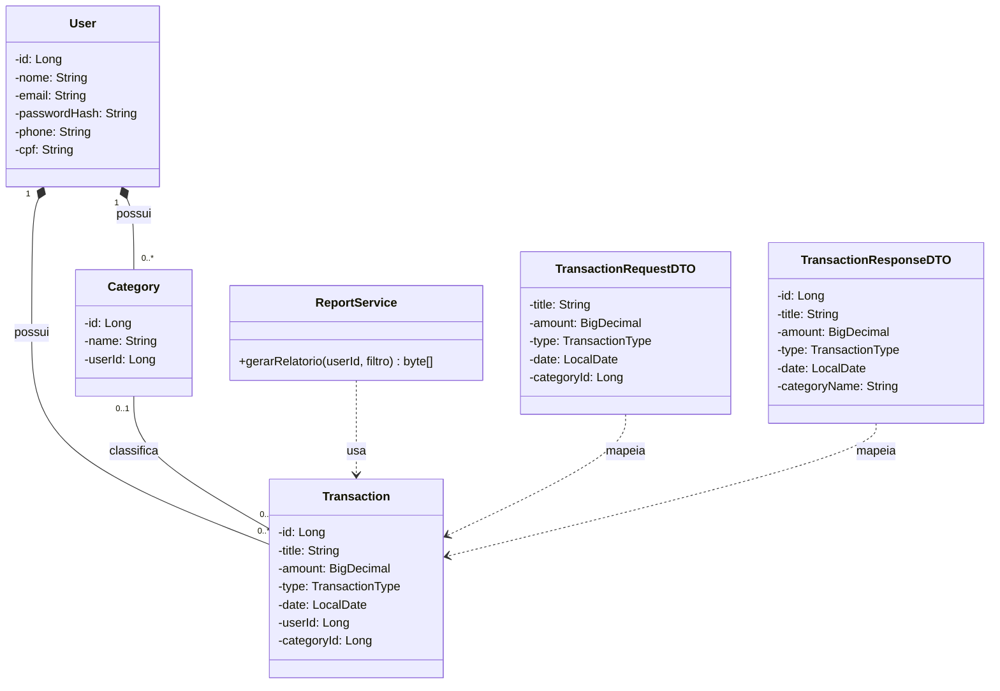

```mermaid
classDiagram
    class User {
        -id: Long
        -nome: String
        -email: String
        -passwordHash: String
        -phone: String
        -cpf: String
    }
    class Category {
        -id: Long
        -name: String
        -userId: Long
    }
    class Transaction {
        -id: Long
        -title: String
        -amount: BigDecimal
        -type: TransactionType
        -date: LocalDate
        -userId: Long
        -categoryId: Long
    }
    class TransactionRequestDTO {
        -title: String
        -amount: BigDecimal
        -type: TransactionType
        -date: LocalDate
        -categoryId: Long
    }
    class TransactionResponseDTO {
        -id: Long
        -title: String
        -amount: BigDecimal
        -type: TransactionType
        -date: LocalDate
        -categoryName: String
    }
    class ReportService {
        +gerarRelatorio(userId, filtro) byte[]
    }
    User "1" *-- "0..*" Category : possui
    User "1" *-- "0..*" Transaction : possui
    Category "0..1" -- "0..*" Transaction : classifica
    ReportService ..> Transaction : usa
    TransactionRequestDTO ..> Transaction : mapeia
    TransactionResponseDTO ..> Transaction : mapeia
```